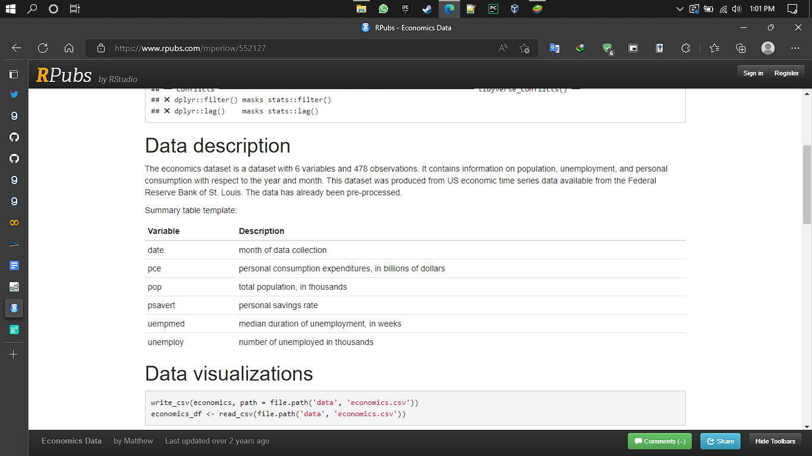
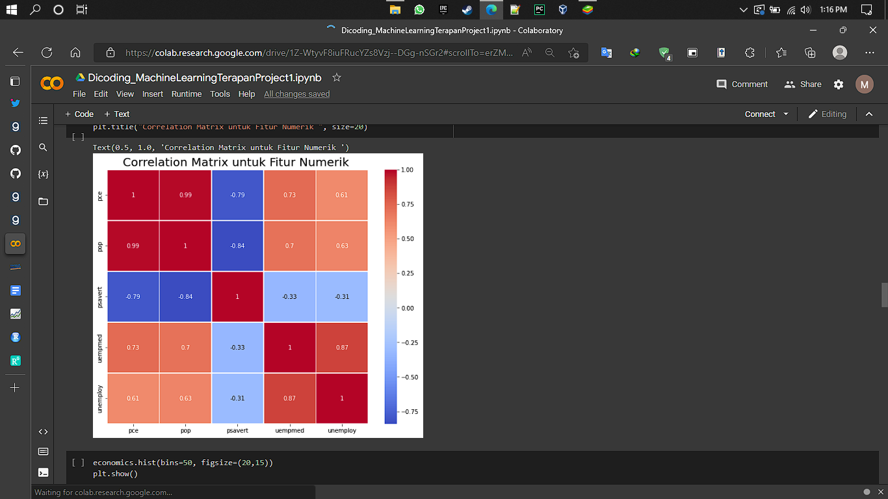
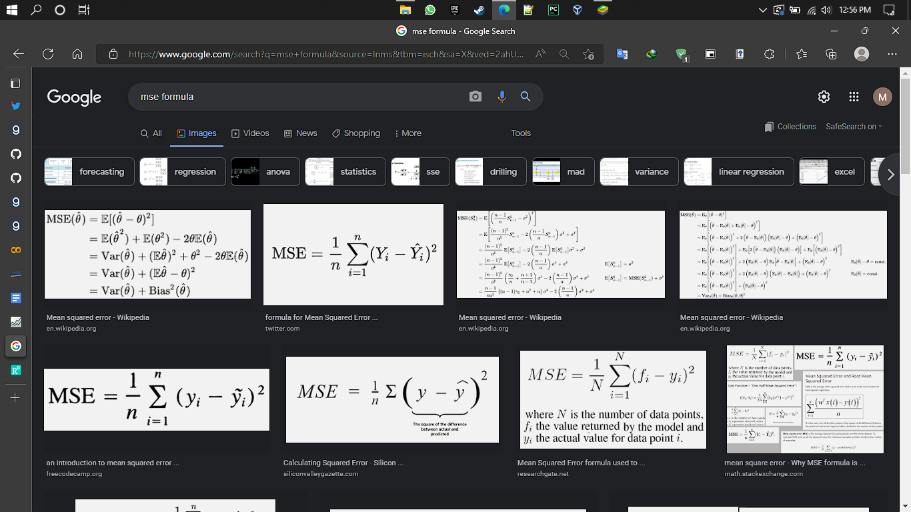
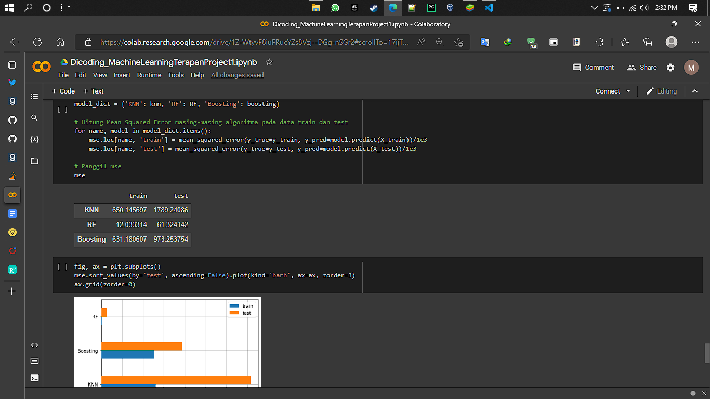
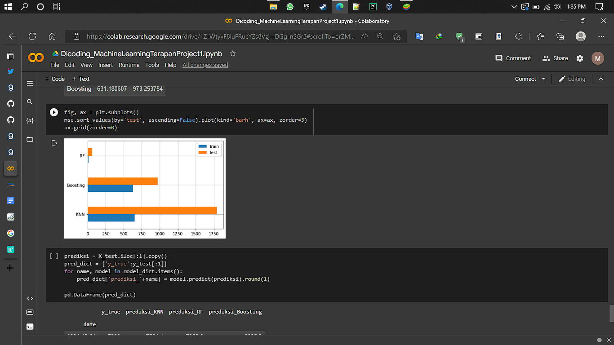
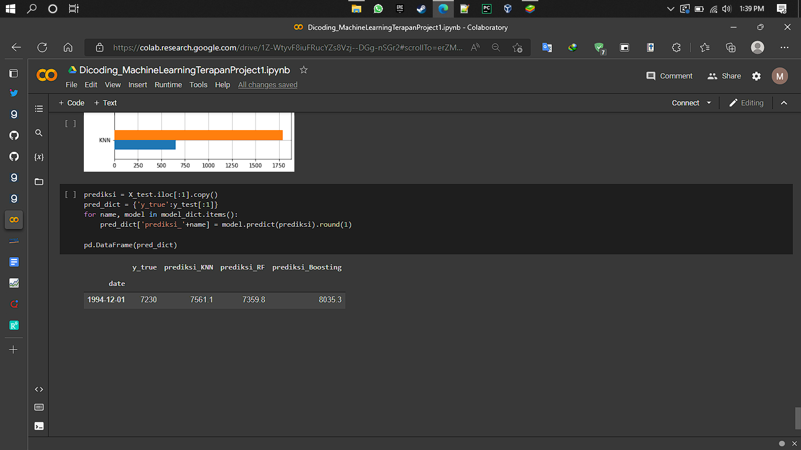

<h1> Laporan Proyek Machine Learning - Miftahul Ardli </h1>

<h2> Domain Proyek </h2>

 Pertumbuhan ekonomi merupakan pertumbuhan yang signifikan berpengaruh terhadap suatu pertumbuhan negara dan masyarakat. Tidak ayal, pertumbuhan ekonomi disangkutpautkan dengan jumlah masyarakat yang tidak bekerja (penganggur). Setiap tahunnya, Perlunya mengetahui pertumbuhan ekonomi di suatu negara diperlukan analisis prediktif untuk mengetahui apakah pertumbuhan ekonomi tersebut membaik atau memburuk. Tidak jarang, jumlah penganggur yang ada di masyarakat menentukan jumlah pendapatan domestik suatu negara tersebut yang dapat berpengaruh dalam kondisi perekonomian suatu negara (C. Iula, 2013). Melihat urgensi tersebut, sistem model prediktif diperlukan untuk mengambil tindakan preventif untuk menghindari kemungkinan terburuk, yaitu resesi ekonomi. 

<h2> Business Understanding </h2>

 Pembuatan model prediktif tersebut dapat diselesaikan dengan cara membuat model sistem prediktif yaitu model linear regresi, dimana model tersebut dapat memprediksi seberapa banyak jumlah masyarakat yang belum memiliki pekerjaan (penganggur) setiap tahunnya berdasarkan <i>features</i>, sehingga pemerintah dapat mengambil langkah preventif atau kuratif untuk mengatasi permasalahan tersebut. 

<h3> Problem Statements </h3>

Dalam pembuatan model prediktif ini, permasalahan yang akan diangkat berdasarkan data yang sudah tersedia tersebut ialah seperti fitur-fitur apa saja yang berpengaruh dalam jumlah peningkatan penganggur serta tingkat performa akurasi untuk model terkait. Harapannya, setelah membuat model, permasalahan-permasalahan tersebut dapat terjawab.

Metodologi yang dipakai untuk jenis permasalahan tersebut ialah menggunakan prediksi regresi linear dengan variabel 'penganggur' sebagai hasil dari komputasi (output).

Dalam pembuatan model prediktif ini, digunakan dataset yang diambil dari dataset salah satu *library* yang tersedia dalam bahasa pemrograman R
(tidyverse), yaitu 'economics'. Data ini diambil dari *Federal Reserve Bank of St. Louis*, salah satu bank penyedia jasa data ekonomi untuk negara Amerika Serikat.

(*source* : [[Federal Reserve Economic Data \| FRED \| St. Louis Fed (stlouisfed.org)]{.ul}](https://fred.stlouisfed.org/))

Dataset yang disediakan tersebut mencakup beberapa variabel yang dianggap penting, beberapa variabel tersebut ialah data terkait populasi, pengangguran, dan konsumsi pribadi sehubungan dengan tahun dan bulan. Dataset ini dihasilkan dari data deret waktu ekonomi AS yang tersedia dari Federal Reserve Bank of St. Louis.

(source : [[RPubs - Economics Data]{.ul}](https://www.rpubs.com/mperlow/552127))

Dataset tersebut kemudian dilakukan pre-processing data karena data tersebut masih dalam keadaan mentah (*raw*) sehingga perlu penyesuaian sedemikian rupa agar dataset tersebut dapat digunakan dengan baik oleh *Machine Learning Engineer*. Beberapa langkah *preprocessing* tersebut mencakup pengubahan tipe data agar dapat diimplementasikan perubahan yang diinginkan, penggantian index baris, penggantian kolom untuk kemudahan dalam pembuatan model, serta memastikan tidak adanya dataset yang bernilai *null*.

Setelah dilakukan proses *pre-processing* data, dataset tersebut dilakukan eksplorasi analisis data dengan tujuan lebih memahami dataset yang digunakan. Beberapa analisis yang dilakukan mencakup analisis statistika dasar serta analisis korelasi antar variabel. Dikarenakan dataset tidak memiliki variabel yang bersifat kategorik, sehingga hanya dilakukan untuk variabel numerik.

(*Source* : Dokumentasi Pribadi)

Hasil matriks tersebut mendeskripsikan bahwa terdapat korelasi lemah antara variabel psavert dengan variabel target, yaitu 'unemploy' serta memiliki korelasi cukup tinggi dengan uempmed, pop dan pce. Dari hasil ini, kita dapat mengabaikan variabel psavert, tentunya berdasarkan standar dari masing-masing bidang (kesehatan, ekonomi, dan lainnya, contohnya korelasi yang jauh lebih rendah dapat dianggap lemah di bidang medis yang dianggap sangat berpengaruh dan krusial dibandingkan dengan bidang teknologi).

Model kemudian dibuat dengan melakukan pemrosesan data terlebih dahulu seperti normalisasi serta pembagian data menjadi training, dan test set, serta melakukan penerapan model tiga algoritma machine learning (K-Nearest Neighborhood, Random Forest, Boosting Algorithm). Pertimbangan menggunakan tiga model tersebut ialah dengan tujuan mengetahui model mana yang paling memberikan performansi paling optimal bagi model.

Metrik yang digunakan untuk mengetahui kualitas dari model yang dibuat ialah menggunakan metrik yang sudah banyak dikenal, yakni MSE (Mean Squared Error), dengan cara menghitung total perbedaan antara poin prediksi dengan poin hasil dikuadratkan kemudian dilakukan pembagian sesuai dengan jumlah data yang digunakan.

(source : DeepLearning.AI)

Hasil performansi dari ketiga algoritma tersebut menunjukkan perbedaan yang cukup signifikan bagi model. Performansi menunjukkan bahwa algoritma random forest memiliki nilai mse yang lebih kecil dibandingkan dengan kedua model lainnya, dengan nilai mse mencapai nilai 1750 untuk KNN yang merupakan model yang memiliki nilai error paling besar dibandingkan dengan random forest yang memiliki nilai error paling kecil dibandingkan ketiga model.

(source : Dokumentasi Pribadi)

(source : Dokumentasi
Pribadi)

Setelah penghitungan nilai mse, model dilakukan prediksi nilai dengan tujuan mengetahui prediksi yang akan dibuat.

(source : Dokumentasi
Pribadi)

Berdasarkan hasil tersebut, model algoritma random forest pun dipilih sebagai algoritma yang digunakan untuk tujuan dari pengembangan model machine learning tersebut. Meski algoritma random forest berjalan sangat baik di sebagian permasalahan machine learning, beberapa algoritma yang belum dicoba seperti XGBoost, *deep learning* pada kumpulan data yang lebih besar, dan beberapa algoritma *supervised learning* lainnya sering unggul dari segi performa. Hal ini sangat tergantung pada banyak kasus seperti jumlah dataset serta permasalahan yang akan diselesaikan.

Source :

> Iulia CRISTINA Iuga. (2013). *Analysis of correlation between the
> unemployment rate and gross domestic product in the European union*.
> ResearchGate; unknown.
> [[https://www.researchgate.net/publication/268980711_Analysis_of_correlation_between_the_unemployment_rate_and_gross_domestic_product_in_the_European_union]{.ul}](https://www.researchgate.net/publication/268980711_Analysis_of_correlation_between_the_unemployment_rate_and_gross_domestic_product_in_the_European_union)
>
> Ng, Andrew. (2022). *Supervised Learning*. DeepLearning.AI
>
> Dicoding Indonesia. (2017). *Machine Learning terapan*. Dicoding.com.
> https://www.dicoding.com/academies/319/corridor
